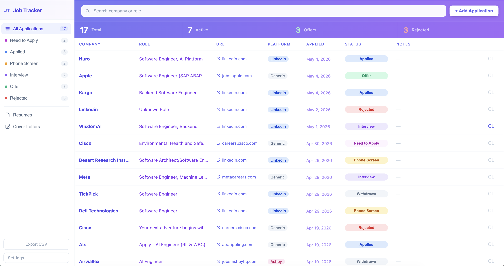
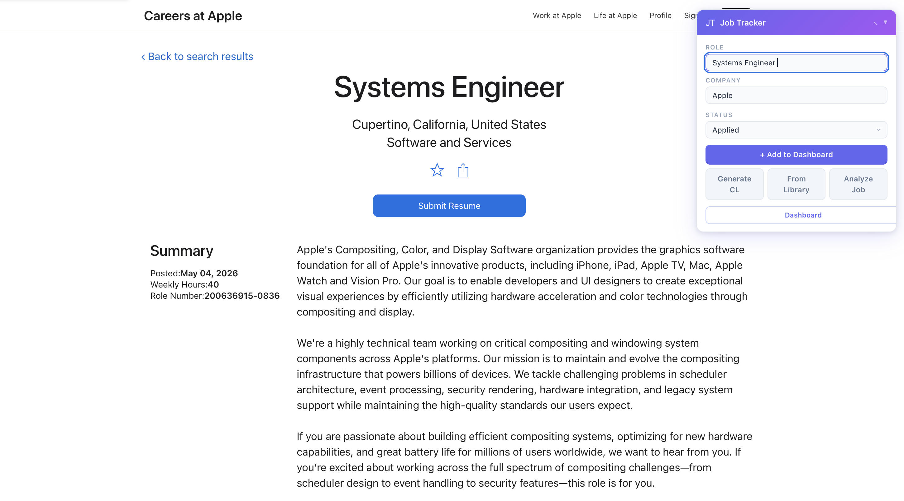
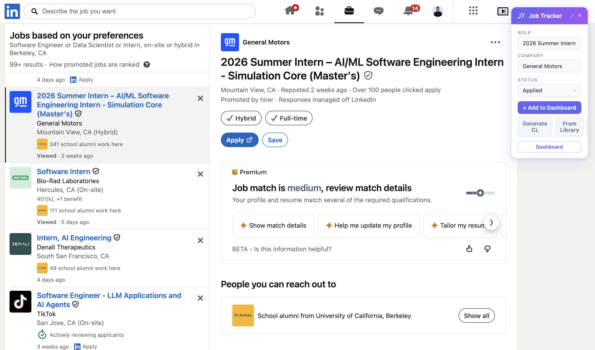
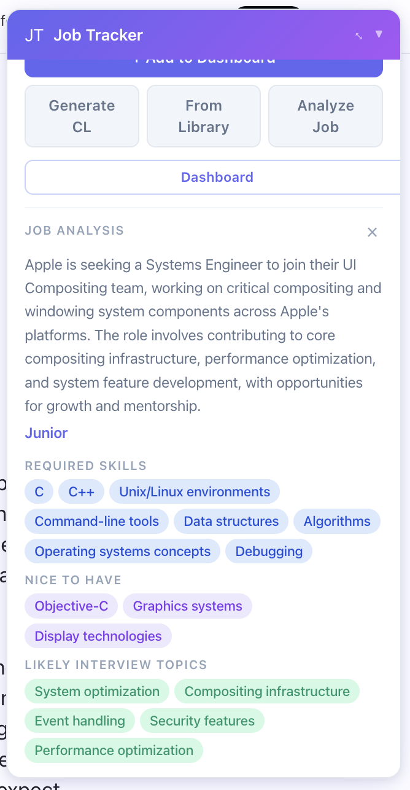
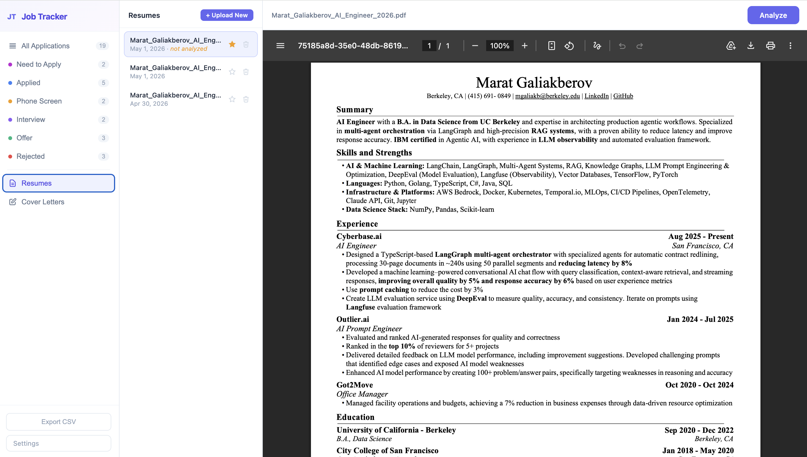
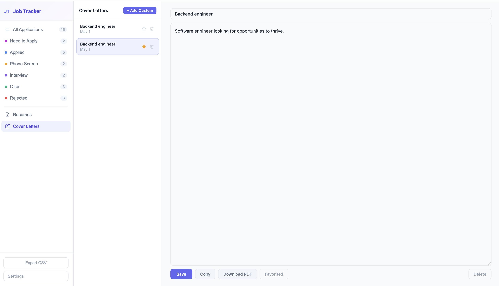

# Job Tracker

A Chrome extension (Manifest V3) for tracking job applications with AI-powered job description analysis, cover letter generation, and resume management. All data is stored locally — no account, no server, no sync.



---

## Features

### Floating Banner
Injects a draggable panel on job pages. Auto-extracts the role and company from the page, lets you save the application in one click, and gives you AI tools without leaving the job listing.

- Auto-detects job platforms (LinkedIn, Greenhouse, Workday, Lever, Ashby, and more) and career URL patterns
- Extracts role and company from DOM, meta tags, and structured data with SPA-retry logic
- Add to dashboard, generate a cover letter, pick from your library, or analyze the JD — all from the banner
- `Alt+Shift+J` to force-inject the banner on any page




### Job Description Analysis
Sends the page's job description to Groq and returns a structured breakdown: summary, seniority level, required skills, nice-to-have skills, and likely interview topics. Result is cached per URL.



### Cover Letter Generation
Generates a tailored cover letter using your favorite resume and the job details (company + role). Saves versioned history per application. Each version can be copied, favorited, downloaded as PDF, or saved to your global library.

### Resume Management
Upload PDF, DOCX, or TXT resumes. Run AI analysis (via Gemini 2.5 Flash through a Cloudflare Worker proxy) to extract skills, experience, strengths, and a summary. Keep multiple versions with a favorite designation — the favorite is automatically used for cover letter generation.



### Dashboard
Full application tracker with filtering, search, inline status changes, and CSV export.

- Filter by status with live counts
- Search by company or role
- Inline status dropdown per application
- Cover letter modal with full version history per application
- Cover Letters library tab for reusable templates
- Export to CSV



---

## Setup

### 1. Install the extension

```
chrome://extensions/ → Enable "Developer mode" → Load unpacked → select this folder
```

### 2. Get a Groq API key

Required for job description analysis and cover letter generation.

1. Go to [console.groq.com/keys](https://console.groq.com/keys) and create a free key
2. Open the extension → Settings → paste the key → Save

### 3. Deploy the Cloudflare Worker (resume analysis)

Required only for AI resume analysis. Skip if you don't need it.

```bash
npm install -g wrangler
wrangler login
wrangler deploy cloudflare/worker.js --name job-tracker-analyzer --compatibility-date 2024-01-01
```

Set secrets:
```bash
wrangler secret put GEMINI_API_KEY --name job-tracker-analyzer
wrangler secret put EXTENSION_TOKEN --name job-tracker-analyzer
```

Then in extension Settings, enter the Worker URL and the same `EXTENSION_TOKEN` value.

---

## Tech Stack

- **Chrome Extension Manifest V3** — service worker, content scripts, local storage
- **Vanilla JS** — no build system, no framework, load unpacked directly
- **Groq API** — `llama-3.3-70b-versatile` for JD analysis and cover letter generation
- **Cloudflare Workers + Gemini 2.5 Flash** — resume analysis proxy
- **mammoth.js** — DOCX text extraction
- **Custom PDF builder** — cover letter PDF export with no external library

---

## Project Structure

```
├── manifest.json
├── background/worker.js      # Service worker — message hub, API calls
├── content/
│   ├── banner.js             # Floating panel injected on job pages
│   └── banner.css
├── popup/                    # Extension popup — stats + recent apps
├── dashboard/                # Full dashboard — table, resumes, cover letters
├── options/                  # Settings — API keys, model selection
├── cloudflare/worker.js      # Cloudflare Worker — Gemini resume analysis proxy
└── lib/mammoth.min.js        # DOCX parser
```
